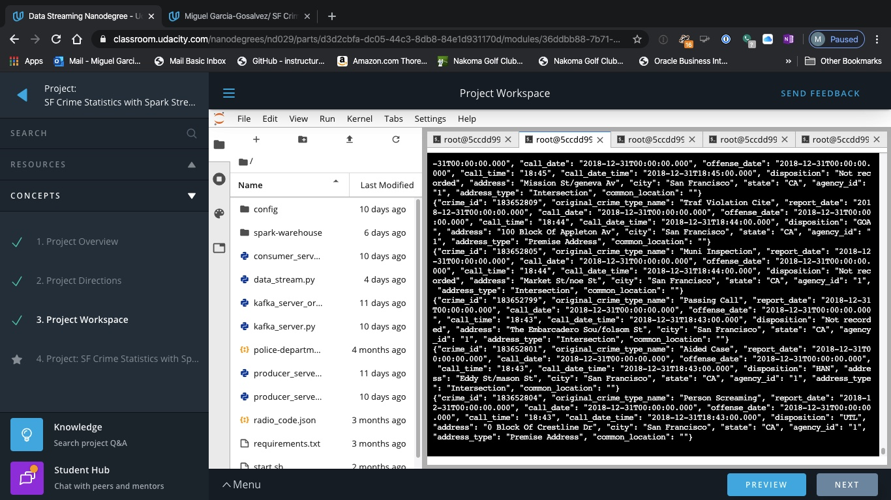
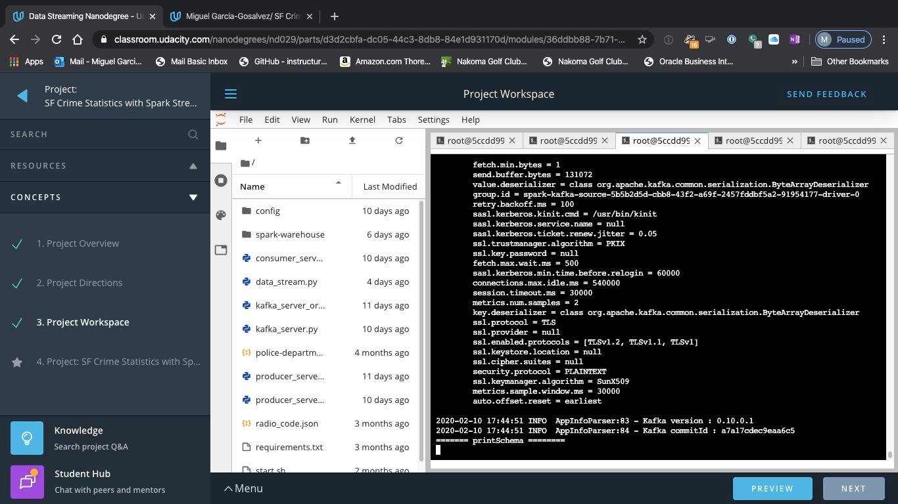
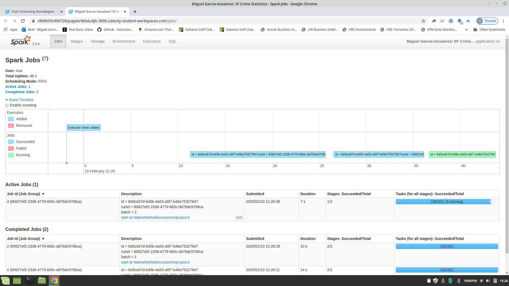

# Udacity DataStreaming Nanodegree - Spark Streaming Project
## Submitted by Miguel Garcia-Gosalvez (February 2020)
## Execution of modules
- I have done all my development using the Workspace provided. All interactions here are provided as if using that Workspace. After the files **config/zookeeper.properties** and **config/server.properties** have been completed it is key to type the following commands in the terminal to start both zookeeper as kafka server:

`>> ./start.sh` (To load all necessary components)
`>> /usr/bin/zookeeper-server-start /home/workspace/config/zookeeper.properties`
`>> /usr/bin/kafka-server-start /home/workspace/config/server.properties`

- In another terminal windows please run the **producer_server.py** and **kafka_server.py** to send the entries of the file *police-department-calls-for-service.json* into a Kafka topic. In terminal, type:

`>> python producer_server.py`
`>> python kafka_server.py`

- To verify that the data is sent properly please type into a new terminal window the command `kafka-console-consumer --bootstrap-server localhost:9092 --topic com.udacity.sf.crime.calls  --from-beginning` or , alternatively, by running the consumer script:

`>> python consumer_server.py`

- Output should look as follows:





- In another terminal windows please run the Spark Streaming Script as follows:

`>> spark-submit --packages org.apache.spark:spark-sql-kafka-0-10_2.11:2.3.4 --master local[*] data_stream.py` 

- The output of executing that command should look as follows:




- In the Udacity Wokspace you can click now on the **preview** button which will open the Spark UI in port 3000. The user interface looks as follows:





## Questions
### Question 1
*How did changing values on the SparkSession property parameters affect the throughput and latency of the data?*

When changing SparkSession property parameters the **throughput** and **latency** will vary. The point is that we are aiming to get high throughput and low latency. If latency becomes too high then throughput will be affected (because the execution of the next batch is delayed until the current batch is completed by the query.

The issue is that inding out the best trade-off is not a trivial issue. In order to achieve the best trade-off we can monitor both the `inputRowsPerSecond`as well as the `processedRowsPerSecond` in the progress report (that you obtain when running the Spark Streaming Script).
    
### Question 2
*What were the 2-3 most efficient SparkSession property key/value pairs? Through testing multiple variations on values, how can you tell these were the most optimal?*

It is well understood that keeping the CPU cores busy allow us to achieve a higher throughput and a lower latency. It seems clear that having too few partitions provokes an  underutilization of the CPU cores available, while having too many partitions means  too much overhead when scheduling tasks. 

Overall, and ideally, we want to have all cores always busy and reduce the scheduling overhead as much as possible. For  performance tuning, managing the number of partitions is important to make sure that cluster resources are used efficiently. It requires trial and error but trying different parameters we look for the combination that provides the highest possible value for`processedRowsPerSecond`.

  To do so (increase the value of `processedRowsPerSecond`) a few options are to test these settings:

   * `spark.sql.shuffle.partitions`: Based on the documentation available this is the number of partitions to use when shuffling data for joins or aggregations. Together with `spark.default.parallelism` determines the parallelism when executing queries. Keeping the number of partitions equal to the number of available cores will result in reducing the overhead in scheduling tasks, since we will have a number of tasks exactly matching the number of cores. As a result, each task will execute on one core. Reducing the overhead in scheduling results in increased throughput and reduced latency.
   * `spark.default.parallelism`: suggested value here is equal to the total number of cores on all executor nodes. For our specific use case, since we run the Spark consumer locally, the preferred setting is to set this equal to the number of cores on the local machine. This way each core will process data coming from a partition, and we will be using all cores in parallel maximizing throughput.
   * `spark.streaming.kafka.maxRatePerPartition`: it is the maximum rate (number of records per second) at which data will be read from each Kafka partition. Putting a limit of the rate allows us to handle peak loads when reading data from the Kafka topic. Depending on the key used to write data to Kafka and on data skew, it might happen, indeed, that while reading a partition a consumer is overwhelmed with data.

To test variations of `inputRowsPerSecond` and `processedRowsPerSecond` we have played changing parameters `spark.sql.shuffle.partitions`,  `spark.streaming.kafka.maxRatePerPartition` and `spark.default.parallelism`.

Some of the examples tested:

```
spark.sql.shuffle.partitions = 25
spark.streaming.kafka.maxRatePerPartition = 25
spark.default.parallelism = 2500

"inputRowsPerSecond" : 13.265782281181256,
"processedRowsPerSecond" : 85.66508824795523
```

```
spark.sql.shuffle.partitions = 12
spark.streaming.kafka.maxRatePerPartition = 12
spark.default.parallelism = 12000
 
"inputRowsPerSecond" : 12.225213100044863,
"processedRowsPerSecond" : 47.74419623302672
```

```
spark.sql.shuffle.partitions = 12
spark.streaming.kafka.maxRatePerPartition = 12
spark.default.parallelism = 1200

"inputRowsPerSecond" : 14.223922808184994,
"processedRowsPerSecond" : 70.80745341614907
```

The best result tested (highest "inputRowsPerSecond" and highest "processedRowsPerSecond") has been as follows :

```
spark.sql.shuffle.partitions = 11
spark.streaming.kafka.maxRatePerPartition = 11
spark.default.parallelism = 11000

"inputRowsPerSecond" : 14.9,
"processedRowsPerSecond" : 113.740458015267178
```
